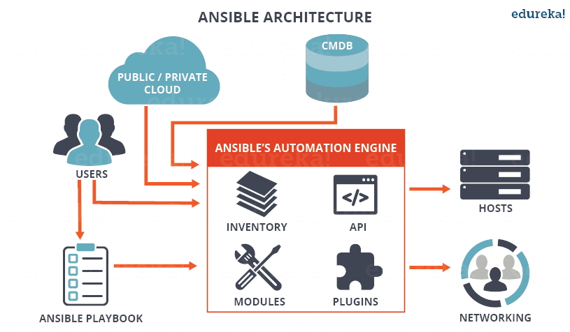
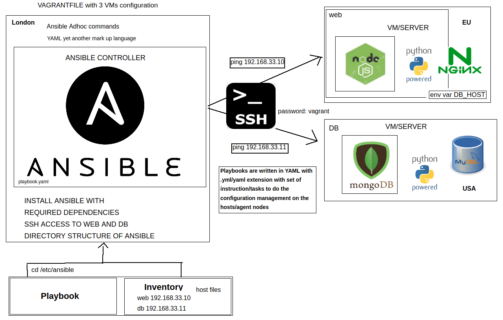
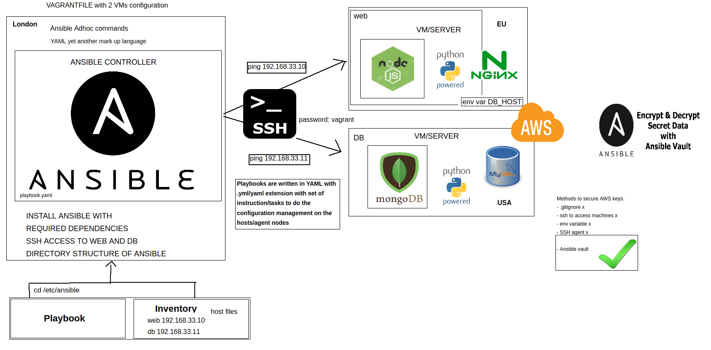

# Infrastructure as Code (IaC) - Ansible

### Summary:

- Types of Infrastructure:
	- Mutable or Immutable
	- On premises or Cloud

- Infrastructure as Code:
	- What is it?
	- How it works?
	- Two parts of IaC:
		- Configuration Management
		- Orchestration

### CTO's choices on IT infrastructure

- On premises + Immutability
- On premises + Mutability - a lot of company running in this way
- Cloud + Mutability
- Cloud + Immutability - becoming popular

What is mutable or immutable:

Mutable -> can be changed. Immutatble -> can not be changed. 

Largely mostly have used mutable environments, ssh in, run bash, restart servers and get it to the place that the machine needs to be. Making something from scratch has its drawbacks as it might take longer but in the long run it's more efficient as you get more predictable result.

### What is IaC?

- IaC is a method of provision and manage IT infrastructure through the use of machine-readable definition files (i.e. source code like yaml), rather than through old fashioned operating procedures and manual processes.

- Infrastructure as code (IaC) is the process of managing and provisioning computer data centers or cloud resources through machine-readable definition files (source code), rather than physical hardware configuration or interactive configuration tools.

- Infrastructure as Code (IaC) automates the provisioning of infrastructure, enabling your organization to develop, deploy, and scale cloud applications with greater speed, less risk, and reduced cost.

- Infrastructure as Code (IaC) uses a high-level descriptive coding language to automate the provisioning of IT infrastructure. This automation eliminates the need for developers to manually provision and manage servers, operating systems, database connections, storage, and other infrastructure elements every time they want to develop, test, or deploy a software application.

### Benefits

- Speed and simplicity
- Configuration consistency
- Minimisation of risk
- Increased efficiency in software development
- Cost savings

With speed and simplicity we save time and that means saving cost.

How do you increase efficiency in your software development life cycle? How do you save cost? How do you speed up the process?

Using IaC. Is going to make infrastructure in seconds. It will automate everything that we usually do manually. It will make it more easy to implement, our lives will be more easy.

### Best Practices

- Codify everything
- Document as little as possible
- Maintain version control
- Continuously test, integrate and deploy
- Make your infrastructure code modular
- Make your infrastructure immutable (when possible, nobody can go in and change it without your permission)

Example of practices? -> talking to multiple servers from ansible controller and doing differents tasks in the differents servers at the same time rather tan log in to the server and doing that manually.

### Two parts of IaC

__Configuration Management__

Tools are resposible for provisioning (anything that we want) and maintaining the state of your systems. There are a lot of tools available to do this but some of the best known are:

	- Chef
	- Puppet
	- Ansible (go to the app and install everything, the same with db)

We are going to use Ansible but all of them have similar structure. If you know how to use one, you will be able to use the rest.

__Orchestration__

Once we've created the templates for all the parts of the system, we need orchestration tools and scripts that talk to the cloud to pull them together into the architecture. Tools:
	
	- CloudFormation (AWS)
	- Ansible (yep it can do this too)
	- Terraform (more to create the VPC, Subnets, etc)

With ansible (powerful tool) you can do both (configuration and orchestration), but we will use ansiblle only for configuration management, and for orchestration we will use terraform.

### Who is using it?

- Cisco
- Hennge
- DLT
- EA Sports
- NASA
- TWITTER
- Udemy
- Revolut
- Alibaba Travels
- etc

There are 1447 companies reportedly use IaC/Ansible in their tech stacks.

### Ansible



- Ansible is an open-source software provisioning, configuration management, and application-deployment tool enabling infrastructure as code.

- Ansible is an IT automation engine that automates cloud provisioning, configuration management, application deployment, intra-service orchestration and more.

- It is a __automation__ tool. Configuration management and orchestration tool that helps us autome the task that we usually do manually.

It works only on Mac and Linux.

__Key benefits/Why Ansible__

- __Simple:__ uses YAML (Yet Another Markup Language). So is simple because it uses YAML which is human readble.

- __Agentless:__ That is, when you create a controller, it contains the Ansible controller, but it does not require any configuration tool installation on the nodes it controls. Makes it lightweight on agent nodes, no need to install in agent notes. So for example you can install the ansible tool in the controller node (let's say master node), so then you will not need to do the same in the agent nodes, they don not need to have ansible tool installed.

- __Secure:__ uses SSH to connect to other servers.

- __Efficient SDLC:__ Integrates with other tools, so we can change provider very easily. If you write a script for one platform (aws) then you can easily switch to another (azure). All we need to do is change the cloud provider, that's it. With integration, you can use ansible with docker for example.

- It is a __automation__ tool. Configuration management and orchestration tool that helps us autome the task that we usually do manually.

- You don't need to have previous experience/knowledge of scripting.



A managed node is any device being managed by the control node. Ansible works by connecting to nodes (clients, servers, or whatever you're configuring) on a network, and then sending a small program called an Ansible module to that node. Ansible executes these modules over SSH and removes them when finished.

We are going to run three virtual machines with vagrant. The configuration file can be found in this repository `vagrantfile`.

Vagrantfile with 3 VMs configuration: the controller, the web and the database servers.

After spinning up the machines `vagrant up`, we can ssh to the Controller running `vagrant ssh controller`.

Let's install Ansible inside the controller:

````bash
sudo apt-get upgrade -y

sudo apt-get update -y

sudo apt-get install software-properties-common -y

sudo apt-add-repository ppa:ansible/ansible -y

sudo apt-get update -y

sudo apt-get install ansible -y

````

After the installation, we can check if ansible was installed correctly running this command `ansible --version`

After than let's ping to the other two machines (web and db). We will do running `ping ip_web` and `ping ip_db`. All the types should be available in the vagrantfile.

We can access from the controller to the web or db machines using ssh: `ssh vagrant@ip_web` or `ssh vagrant@ip_db`. The password is `vagrant`.

Let's install the tree command: `sudo apt-get install tree -y`. The tree is a tiny, cross-platform command-line program used to recursively list or display the content of a directory in a tree-like format.

In the `/etc/ansible/hosts`, we will need to add the connections. Let's open the file `sudo nano /etc/ansible/hosts` and added this lines:

````
[web]
ip_of_web_machine ansible_connection=ssh ansible_ssh_user=vagrant ansible_ssh_pass=vagrant

````

We can check if now ansible has a connection with the server running the `ping` module: `ansible -m ping web`.

If the ping works, we would receive a message back with success status in green letters.

Do the same with db.

- __Ansible Adhoc commands:__

The Ad-Hoc command is the one-liner ansible command that performs one task on the target host. It allows you to execute simple one-line task against one or group of hosts defined on the inventory file configuration. An Ad-Hoc command will only have two parameters, the group of a host that you want to perform the task and the Ansible module to run.

The Ad-Hoc command gives you more advantage for exploring ansible itself. You are able to perform tasks without creating a playbook first, such as rebooting servers, managing services, editing the line configuration, copy a file to only one host, install only one package.

An Ansible ad-hoc command uses the /usr/bin/ansible command-line tool to automate a single task on one or more managed nodes. Ad-hoc commands are quick and easy, but they are not reusable. So why learn about ad-hoc commands first? Ad-hoc commands demonstrate the simplicity and power of Ansible.

Ad-hoc commands are great for tasks you repeat rarely. For example, if you want to power off all the machines in your lab for Christmas vacation, you could execute a quick one-liner in Ansible without writing a playbook. An ad-hoc command looks like this:

`ansible [pattern] -m [module] -a "[module options]"`

- `-m` specifies a module

- `-a` just means adhoc

- Find out the UPTIME of db server using Ansible Ad-hoc command:

`ansible db -m shell -a "uptime"`

- Update and upgrade all packages using Ansible Ad-hoc command:

`ansible all -m shell -a "sudo apt-get update -y"`

`ansible all -m shell -a "sudo apt-get upgrade -y"`

If it did not work, run this command:

`ansible all -m shell -a "sudo apt-get upgrade -y" --become`: the flag --become is used to run it as a admin mode.

Basic commands:

- To ping: `ansible -m ping web` or `ansible web -m ping`. You can ping both machines at the same time `ansible all -m ping`.

- `ansible web -a "uname -a"`

- `ansible web -a "date"`

- `ansible web -a "free -m"`

- `ansible web -m shell -a "ls -a"`

- `ansible all -m shell -a "uptime"`

- `ansible all -a "uptime"`

- `ansible db -m shell -a "uptime"`

- To know more about them, [link](https://docs.ansible.com/ansible/latest/user_guide/intro_adhoc.html).

- __Playbook:__

An Ansible playbook is a blueprint of automation tasks—which are complex IT actions executed with limited or no human involvement. Ansible playbooks are executed on a set, group, or classification of hosts, which together make up an Ansible inventory.

Ansible playbooks help IT staff program applications, services, server nodes, or other devices without the manual overhead of creating everything from scratch. And Ansible playbooks—as well as the conditions, variables, and tasks within them—can be saved, shared, or reused indefinitely.

An Ansible playbook is an organized unit of scripts that defines work for a server configuration managed by the automation tool Ansible. The playbook is the core component of any Ansible configuration. An Ansible playbook contains one or multiple plays, each of which define the work to be done for a configuration on a managed server. Ansible plays are written in YAML. Every play is created by an administrator with environment-specific parameters for the target machines

- Let's create a `yml` file: `sudo nano install_nginx.yml` (inside /etc/ansible).

- Let's see the syntax of the file (watch out for indentation):

````
# This is an example of ansible playbook written in YAML
# YAML file starts with three --- dashes(---)
---

- hosts: web
# host is to define the name your host machine or you could do all if you would like to run the same task in all the servers

  gather_facts: yes
# gathering facts before performing any tasks

  become: yes
# become is used to get root permission to perform any taks that require admin access

  tasks:
# tasks are executed in order, one at a time, against all servers matched by the host
# every task should a name, which is included in the output from running in the playbook
# The goal of each task is to execute a module, with every specific arguments

# In this task we would like to install Nginx on our server
  - name: Installing Nginx
    apt: pkg=nginx state=present

   # notify:
   # - restart nginx
   # - name: Enable nginx during boot
     # service: name=nginx state=started enabled=yes
````

- Run the playbook: `ansible-playbook install_nginx.yml`.

- Let's create a `yml` file: `sudo nano install_nginx.yml` (inside /etc/ansible).

````
---
# Install SQL on DB machine
- hosts: db
# hosts will look for db in the hosts/inventory file

  become: true
# running in admin mode

  tasks:
# instructions/code/script to install SQL
  - name: Installing SQL in the DB server
    apt: pkg=mysql-server state=present
# the db will have the sql installed and available/enabled
````

- Run the playbook: `ansible-playbook install_sql.yml`.

- The name of the tasks should be relevant for the reason that we will see in the output what tasks are executing.

````
PLAY RECAP *********************************************************************
192.168.33.11              : ok=2    changed=1    unreachable=0    failed=0    skipped=0    rescued=0    ignored=0
````

If we run something and it wasn't modified, it could be a problem. But it was changed and we run the playbook again, then the changed flag should be 0 because we have already installed it and by default it will check that it is already installed so it is not necessary to install again.

````
PLAY RECAP *********************************************************************
192.168.33.11              : ok=2    changed=0    unreachable=0    failed=0    skipped=0    rescued=0    ignored=0 
````

- Let's create a `yml` file: `sudo nano install_nodejs.yml` (inside /etc/ansible).

````
---
# Install SQL on DB machine
- hosts: db
# hosts will look for db in the hosts/inventory file

  become: true
# running in admin mode

  tasks:
# instructions/code/script to install SQL
  - name: Installing SQL in the DB server
    apt: pkg=mysql-server state=present
# the db will have the sql installed and available/enabled
vagrant@controller:/etc/ansible$ cat install_nodejs.yml 
---
- hosts: web
  gather_facts: yes
  become: true

  tasks:
  - name: Installing nodejs in the web server
    apt: pkg=nodejs state=present

  - name: Installing NPM
    apt: pkg=npm state=present
````

- Run the playbook: `ansible-playbook install_nodejs.yml`.

- Let's create a `yml` file: `sudo nano install_mongodb.yml` (inside /etc/ansible).

````
---
# Installing Mongodb for our db to connect to web app so the /posts can work

- hosts: db
  gather_facts: yes
  become: true

  tasks:
  - name: Installing Mongodb into our DB server 192.168.33.11
    apt: pkg=mongodb state=present
````

- Run the playbook: `ansible-playbook install_mongodb.yml`.

Four simple playbooks to understand all the syntax.

But we can put all the code together to run everything just once.

- YAML Ain't Markup Language: A markup language is a computer language that uses tags to define elements within a document. It is human-readable, meaning markup files contain standard words, rather than typical programming syntax. While several markup languages exist, the two most popular are HTML and XML

So, with Ansible we first used some ad-hoc commands to have some kind of remote execution or remote administration interface. With each command we choose the server (or server group) on which this command should be run. As we wanted more complex remote administration to be run, we stuck with the use case and put the commands in a (predefined) playbook, which should be run on hosts of my choice. Ansible adhoc can be used for a quick check, since playbook to do more than one task.

- __Ansible Vault:__



Ansible Vault is a feature of ansible that allows you to keep sensitive data such as passwords or keys in encrypted files, rather than as plaintext in playbooks or roles. These vault files can then be distributed or placed in source control.

Encryption with Ansible Vault ONLY protects ‘data at rest’. Once the content is decrypted (‘data in use’), play and plugin authors are responsible for avoiding any secret disclosure, see no_log for details on hiding output and Steps to secure your editor for security considerations on editors you use with Ansible Vault.

- Inside de controller, run these commands:

````
sudo apt-add-repository --yes --update ppa:ansible/ansible
sudo apt install ansible -y
sudo apt install python3-pip -y
pip3 install awscli
pip3 install boto boto3
sudo apt-get update -y
sudo apt-get upgrade -y
````

- After installing everything, in the folder /etc/ansible, run:

````
sudo mkdir group_vars
cd group_vars
sudo mkdir all
cd all
````

- Then, we are going to create our file of ansible vault:

`sudo ansible-vault create pass.yml` -> write down a password

- Inside the file enter:

````
aws_access_key: THISISMYACCESSKEY
aws_secret_key: THISISMYSECRETKEY
````

- Press Esc and then `:wq` to save the file.

- Run `sudo cat pass.yml` and you will see it is encrypted. Amazing, we have created our ansible vault.

- In our case we will use ansible vault to create instances in amazon web services from the controller.

- Therefore if we create a file called `create_ec2_instance.yml`, we will execute it as follows to connect to aws using our ansible vault:

`sudo ansible-playbook create_ec2_instance.yml --ask-vault-pass`

- In the case of running right now on one of our previously created playbooks:

`sudo ansible-playbook install_nginx.yml --ask-vault-pass`

Enter the password but you will see an error because we are not doing nothing related with AWS.

- Try to run without vault: `sudo ansible-playbook install_nginx.yml`. You will see an error so we have to resolve it.

- Let's delete the `pass.yml` file.

- Then ssh for both machines, web and app, and do the following steps:

````
# Next go to
cd etc/ssh
# next open sshd_config file
sudo nano sshd_config
# change below permissions
# PermitRootLogin yes
# change authentication to yes
# PasswordAuthentication yes
# save and exit the file
# restart the ssh service
sudo systemctl restart ssh
sudo passwd
````

- After that you can go back to your controller and re-run your playbook and your problem should be fixed. Everything has gone back to the way it was before, without ansible vault.

### Task

Click here, [link](https://github.com/alfonso-torres/eng84_ansible_controller_task), to see the practical implementation. ENJOY THE TASK!
